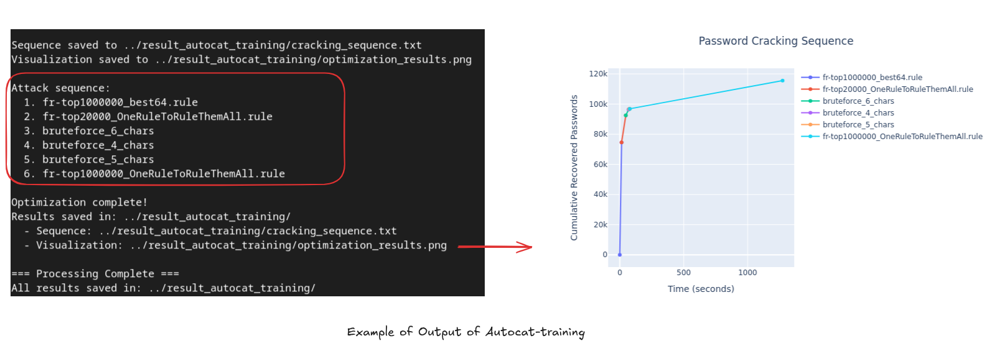
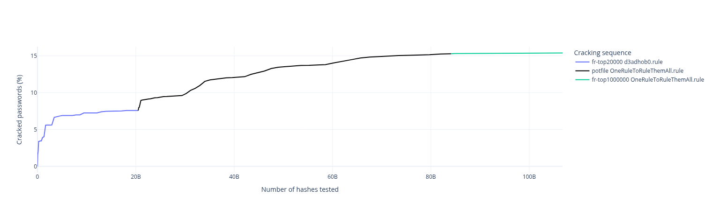
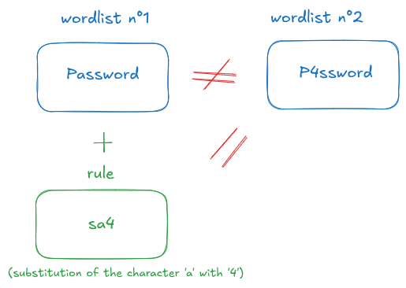
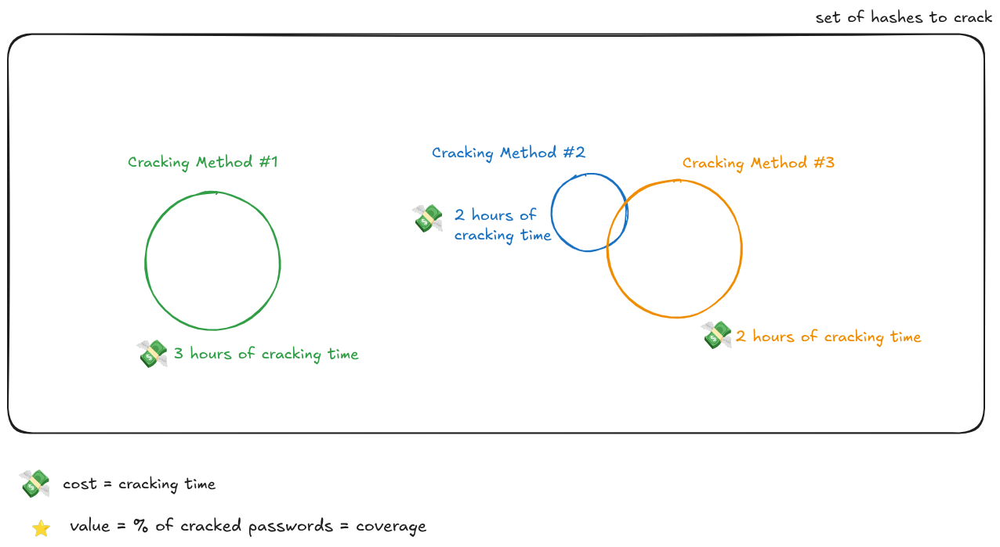
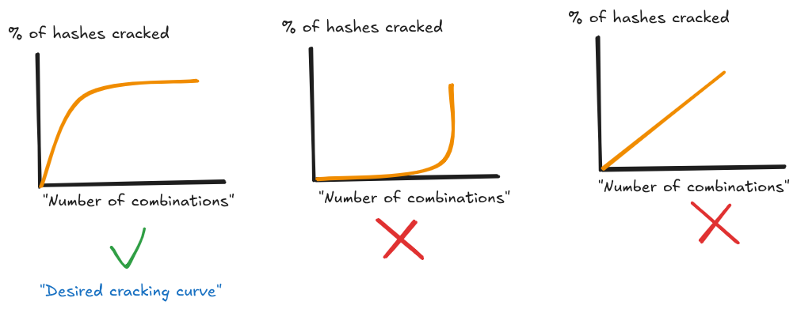
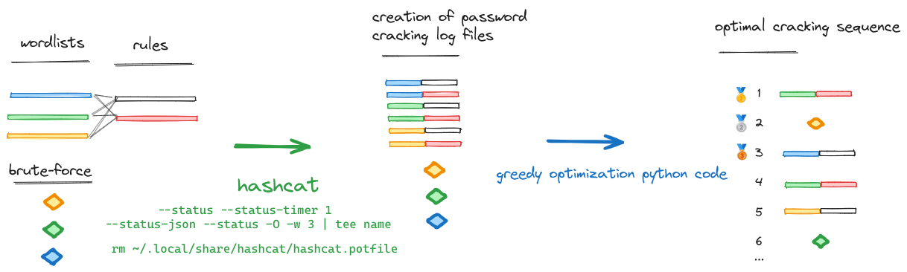
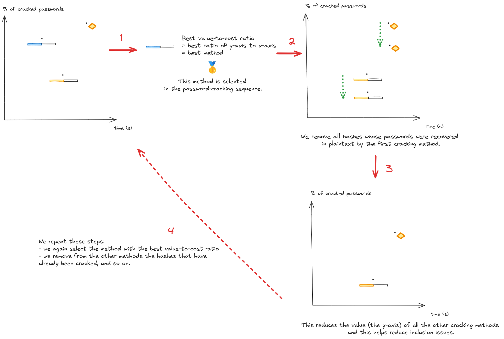

# Autocat-training

<div align="center">
    
</div>

## Overview

Autocat-training aims to solve the **knapsack problem** using a **greedy algorithm** to determine the **most optimal password cracking sequence** for cracking a given input list of hashes and a list of cracking methods (wordlists, rules, brute-force) that you can specify in the `config.json` file.

> [!NOTE]
> This can enable benchmarking with a large number of hashes from diverse sources to determine a generic cracking sequence that effectively cracks hashes from a specific language or geographic region.

## Usage

First, you must specify in the `config.json` file the paths to the wordlists, rules, and the number of characters you want to use for brute force. All wordlists will be cracked using all rules with hashcat.

```bash
./autocat-training.sh -m <hash_type> -p <hash_file> [-t <timeout>] [-o <output_dir>]
```

Autocat-training performs all cracking methods specified in the configuration file (brute force, and all wordlists with all rules), and saves Hashcat logs to the specified `output_dir` file.

A **greedy optimization** algorithm is then launched to determine the best cracking sequence suited to the list of hashes `hash_file` specified as input.

<div align="center">
    
</div>

## Theory

The goal is to obtain the best password cracking sequence tailored to a defined list of hashes.

### Some definitions

- **Cracking method**: technique used to try to recover a plaintext password from a hash according to a defined strategy, for example:
    - RockYou (wordlist) + best64 (rules)
    - 8-character brute-force

- **Cracking sequence**: the set of cracking methods used during a cracking session.

- **Cracking curve**: curve of the number (or percentage) of hash entries recovered in plaintext as a function of time. It is a monotonically increasing curve.
> [!NOTE]
> It is also possible to define this curve with the number of combinations tested on the x-axis, which makes the curve independent of the hardware used and the hash type. The number of combinations is proportional to the cracking time (with exceptions: brute-force can be faster than dictionary-based cracking).

<div align="center">
    
</div>

<div align="center">Cracking curve of a cracking sequence composed of 3 cracking methods of the 'wordlist + rules' type </div>

### Understanding the problem

Randomly selecting wordlists from the internet and using them as a cracking method is inefficient, because these wordlists may include redundant or inappropiate entries.

Furthermore, due to the rules applied, two different wordlists may crack the same passwords. Simply removing common passwords from the wordlists is not enough to ensure that each cracking method cracks different passwords.

<div align="center">
    
</div>

<div align="center">Wordlist 1 and Wordlist 2 are strictly different, but due to the rule applied to Wordlist 1, they can crack the same password.</div>
<br>

The rules can introduce overlaps between different wordlists, so it is better to reason in terms of {wordlist + rule} pairs rather than wordlists alone. To avoid these inclusion issues, it could also be relevant to use thematic wordlists such as those by [clem9669](https://github.com/clem9669/wordlists), but how should we order and select them?

### The knapsack problem and the greedy algorithm to solve it

Each cracking method has a cost, which is its cracking time, and a value, which is the percentage (or number) of cracked hashes. We are in the same situation as with the [Knapsack problem](https://en.wikipedia.org/wiki/Knapsack_problem) 🎒

<div align="center">
    
</div>

For a fixed list of hashes:
- **Weight** ↔️ Cracking time of the selected cracking method ≈ Number of hashes tested.
-  **Value** ↔️ % of the password list recovered in plaintext by the cracking method.

**Particularities compared to the knapsack problem:**
-  The weight of the methods (or, correspondingly, the knapsack size) depends on the hash type, the hardware, etc.
-  There are inclusion issues.
-  We want to crack passwords as quickly as possible, whereas the knapsack problem does not deal with priorities.

This last condition means that we aim to obtain a cracking curve in the form of a **decreasing exponential**.

<div align="center">
    
</div>

We want to choose the wordlists that maximize the value-to-cost ratio at each step (and while taking into account the inclusion problem). The best solution to solve this knapsack problem applied to password cracking appears to be a **greedy algorithm**.

> [!WARNING]
> A greedy algorithm follows the principle of making, step by step, **a locally optimal choice**. ⚠️ It does not always guarantee the optimal solution for all problems — it's a heuristic approach

### Autocat-training

Autocat-training aims to solve this knapsack problem and output an optimal heuristic cracking sequence. All wordlists provided as inputs will be run with all rules; then cracking sequences using the brute-force will also be executed (using Hashcat's default mask). The hashcat potfile is deleted after each cracking method.

<div align="center">
    
</div>

<div align="center">General principle of Autocat‑training</div>
<br>

The Python file `greedy_optimization.py` contains the greedy algorithm used, whose principle is detailed below:

<div align="center">
    
</div>

## Other Tools

- [Autocat](https://github.com/k4amos/Autocat) : This tool makes it easy to run a cracking sequence with Hashcat without launching each method 'by hand'. Moreover, at the end of each method, the new passwords recovered in plaintext in the potfile are used as a wordlist together with a rule, which significantly improves cracking performance. This tool is pre-configured to crack French passwords: a large benchmark was run with Autocat‑training with a significant number of French hashes from various sources, which were cracked using a GPU. The sequence obtained is Autocat's default, but it is possible to define a custom sequence for other languages.
- [cracking_curve](https://github.com/k4amos/cracking_curve) : This tool makes it easy to display the cracking curve obtained with Hashcat/Autocat.


## Disclaimer

> [!CAUTION]
> This tool is provided for educational and authorized security testing purposes only. Users are responsible for complying with all applicable laws and regulations. The authors assume no liability for misuse or damage caused by this tool.
